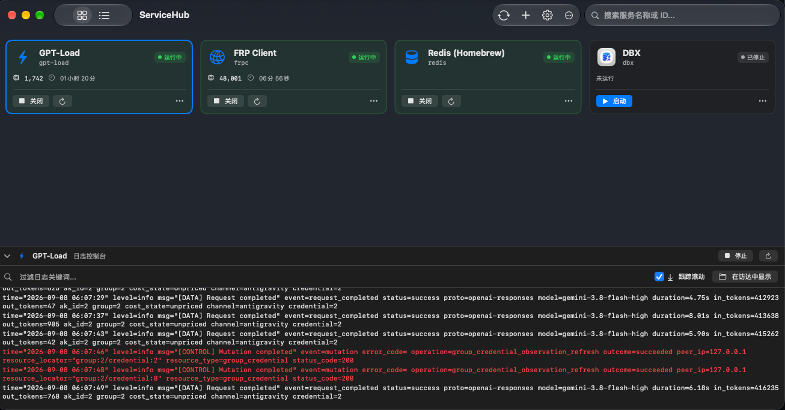
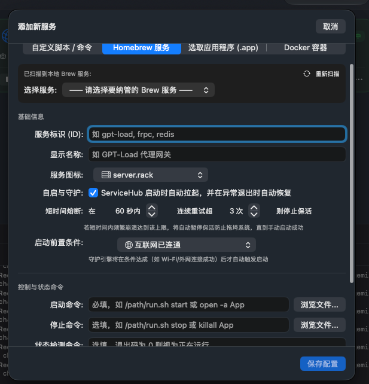
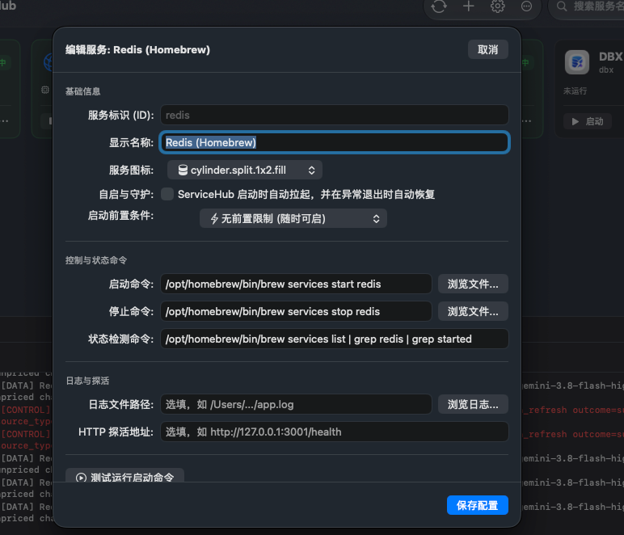
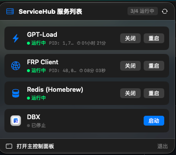

# ServiceHub

<p align="center">
  
</p>

<p align="center">
  <b>一款专为 macOS 设计的现代化本地服务可视化管理工具与守护引擎</b><br>
  A modern, native macOS local service manager and supervisor.
</p>

<p align="center">
  <a href="README.md">简体中文</a> •
  <a href="README_EN.md">English</a> •
  <a href="LICENSE">MIT License</a>
</p>

<p align="center">
  
  
  
  
</p>

---

## 💡 项目简介

在本地开发与日常运维中，我们往往运行着大量分散的服务：本地 Shell 启停脚本（如 GPT-Load、FRP 内网穿透）、Homebrew 后台服务（Redis、MariaDB）、macOS 桌面应用程序（DBX、各类工具），以及各类 Docker 容器。

**ServiceHub** 采用 **Swift 6 + SwiftUI** 原生开发，旨在将这些异构服务全部收敛到一个优雅、极简、现代化的控制面板中，提供**统一纳管、智能守护保活、防雪崩熔断、快捷指令级前置条件判断与实时日志流监控**。

---

## 📸 界面预览

### 1. 现代化控制看板与底部实时日志流
> 支持**高对比度卡片视图 (Card Grid)** 与 **列表视图 (List)** 一键自由切换；实时展示每个服务的原生图标、运行状态徽章、真实进程 PID 与运行时长；点击任意卡片即可在底部控制台实时追踪日志流并支持关键字高亮过滤。



---

### 2. 四大类型服务一键纳管向导
> 内置 **自定义脚本**、**Homebrew 服务自动扫描**、**选取 macOS 应用程序 (.app)**、**Docker 容器自动扫描** 4 大快速模板，支持一键选取与自动填充完整控制命令。



---

### 3. 类似快捷指令（Shortcuts）的前置条件与防雪崩熔断
> 支持设置启动前置条件（如外网已连通、连接指定 Wi-Fi、插电中、外接屏等），守护引擎在前置条件未满足时优雅等待，条件达成瞬间自动拉起服务；支持设定短时间连续重启上限，触发熔断保护防止拖垮系统。



---

### 4. 顶部状态栏常驻控制中心 (MenuBarExtra)
> 匹配 macOS 原生规范的黑白单色 Template 状态栏图标；点击弹出专属控制卡片，每条服务均提供独立的「启动」、「关闭」、「重启」按钮，支持查看已运行时长与实时状态。



---

## ✨ 核心特性

- **四大异构服务统一纳管**：
  - **自定义脚本 / 命令**：填入启动、停止、状态命令即可纳管任意复杂脚本，输入框自带「浏览文件」按钮；
  - **Homebrew 服务**：全自动异步扫描本机已安装的 `brew services`（Redis、MariaDB、Nginx 等），一键下拉挑选即可自动补齐命令；
  - **macOS 原生应用程序 (.app)**：支持直接从访达选取系统应用，自动提取应用原生高清图标（Squircle）、Bundle ID 与控制命令，通过 `NSRunningApplication` 核心接口实现 100% 精确的进程存活性检测；
  - **Docker 容器**：自动扫描本地所有 Docker 容器，一键选取纳管容器的启动、停止与状态监控。
- **类似快捷指令 (Shortcuts) 级前置条件检测**：
  - **网络环境**：外网已连通、网络已断开 (离线)、已连接 Wi-Fi (可指定 SSID 匹配)、Wi-Fi 已断开、VPN/代理已就绪；
  - **蓝牙设备**：蓝牙开启/关闭、指定蓝牙设备已连接 (如 AirPods Pro)；
  - **硬件与电源**：已连接电源适配器 (插电)、使用电池供电中、已连接外接显示器、指定外部磁盘卷宗已挂载；
  - **高级检测**：指定本地端口可用 (未占用)、目标主机可达 (Ping)、自定义 Shell 判定。
- **后台智能保活与防雪崩熔断 (Crash-Loop Backoff)**：
  - 对开启自启守护的服务，异常退出后后台自动重拉；
  - 支持自定义**时间窗口**与**最大连续重启次数**（如 60 秒内连续重试超 3 次自动熔断），防止配置错误导致死循环重启占满 CPU。
- **状态命令 (Status Command) 规范说明**：
  - ServiceHub 通过执行「状态命令」并读取其**进程退出码 (Exit Code)** 来判定服务是否存活，**命令的标准输出内容不会被用于判定**；
  - **退出码 `0` = 运行中，非 `0` = 已停止**，这是唯一的判活标准；
  - ⚠️ **特别注意**：很多 Shell 脚本（尤其是带 `set -e` 或内部使用了 `grep` 等命令的脚本）即使服务已正常运行，也可能因为中间命令失败而返回非 0 退出码，或无论服务死活都永远 `exit 0`。这两种情况都会导致 ServiceHub 的状态判定失真（例如服务已崩溃却始终显示「运行中」，守护引擎也不会触发自动重启）；
  - ✅ **正确写法示例**：
    ```bash
    # 1. 使用 pgrep 直接检测进程（推荐）
    pgrep -f "frpc" >/dev/null

    # 2. 检测 Homebrew 服务是否 started
    brew services list | grep "^redis" | grep -q "started"

    # 3. 检测 Docker 容器是否 Running
    docker inspect -f '{{.State.Running}}' my-container | grep -q "true"

    # 4. 检测端口是否被监听
    lsof -i :8080 >/dev/null 2>&1
    ```
  - ❌ **错误示例**：`echo "Service is running"`（永远返回 0，无论死活都会被误判为存活）、`tail -n 5 app.log`（最后一行日志不包含 error 时可能返回 0，包含时返回 1，与进程死活无关）；
  - 💡 **调试建议**：在添加服务弹窗中点击「测试运行启动命令」旁的「测试」逻辑同理适用于状态命令——可先在终端手动执行状态命令，然后运行 `echo $?` 查看退出码是否为 0（存活）/ 非 0（停止），确保脚本在任何情况下都返回**可靠的、可区分的退出码**；
  - 📋 **自管理脚本接入模板**：如果您编写了自己的服务管理脚本（如 `xxx.sh start|stop|status`），请在 `status` 分支末尾**显式约定退出码**，示例如下：
    ```bash
    do_status() {
        if is_running; then
            log "服务：运行中（PID $(cat "${PID_FILE}")）"
            exit 0          # ✅ 运行中必须显式返回 0
        else
            log "服务：未运行。"
            exit 1          # ✅ 已停止必须显式返回非 0
        fi
    }
    ```
    ⚠️ 注意两个常见陷阱：
    1. **不要依赖分支末尾的隐式返回值**——`do_status` 内部若最后一行是 `log "xxx"` 或 `networksetup ...` 等外部命令，函数退出码将取决于该命令，而非服务真实状态，务必在每个分支显式 `exit 0` / `exit 1`；
    2. **开启 `set -e` 的脚本需防止误杀**——`set -Eeuo pipefail` 会让脚本内任何中间命令失败（如 `grep` 未命中、文件不存在）直接以非 0 退出整个脚本，可能与状态判定语义冲突，建议在状态检测的中间命令后追加 `|| true` 兜底，或在 `status` 分支内使用独立的局部逻辑避免被外层 `set -e` 干扰。
- **服务检测更新与升级命令规范 (Update & Check-Update Specification)**：
  - **ServiceHub 生命周期编排原则**：当触发「立即更新并重启」时，ServiceHub 将严格按安全流水线编排：**先平滑停止旧服务（释放端口与文件句柄、挂起自启守护） ➔ 异步执行更新命令 ➔ 更新成功后自动拉起重启服务**。因此更新命令只需专注于下载/替换程序本身，无需在脚本内自行杀死或重启进程；
  - **检测更新命令 (Check Command) 规范约定**：
    - **有新版本可用**：命令退出码必须为 `0`，且 stdout 标准输出**包含新版本描述的非空文本**（例如：`v2.0.1 (当前: v2.0.0)`）。该输出的首行将直接展示在服务卡片徽标与更新详情弹窗中；
    - **当前已是最新**：命令退出码必须为 `0`，且 stdout **输出为空**（或仅在 `--verbose` 时输出提示）。当输出为空时，ServiceHub 会判定为已是最新，在手动点击检查时自动弹出「已是最新版本」反馈框；
    - **检测失败 / 异常**：退出码返回非 `0`。
  - **更新升级命令 (Update Command) 规范约定**：
    - 负责下载新程序、覆盖二进制、拉取 Git 代码或拉取 Docker 镜像；
    - **退出码必须真实有效**：更新成功必须显式返回 `0`；更新失败（如网络超时、编译报错、校验错误）必须返回非 `0`。ServiceHub 检测到失败时会**终止自动重启**并在界面红色标红报错，防止损坏的文件陷入崩溃自启风暴。
  - ✅ **常见服务规范写法示例**：
    - **Homebrew 服务**：
      - 检测命令：`/opt/homebrew/bin/brew outdated --verbose <formula> 2>/dev/null || true`
      - 更新命令：`/opt/homebrew/bin/brew upgrade <formula>`
    - **Git 仓库类服务 (如 WebUI / 脚本)**：
      - 检测命令：`git fetch origin && git log -1 --oneline HEAD..@{u}`（若有远端更新则输出 commit，若无更新则输出为空）
      - 更新命令：`git pull`
    - **Docker Compose 服务**：
      - 检测命令：调用纯元数据检测脚本（推荐，见下方专属示例），或留空仅按需点击升级；
      - 更新命令：`docker compose pull && docker compose up -d`（⚠️ 必须配合 `up -d`，单纯的 `docker pull` 无法重建生效新镜像）。
  - 🐳 **Docker 零下载流量纯元数据检测更新规范 (推荐实践)**：
    > ⚠️ **避免误区**：切勿在「检测命令」中直接运行 `docker pull`，否则每次检测都会把几个 GB 的镜像完整下载到本地；也不要使用不存在的 `--dry-run`。
    >
    > ✅ **标准做法**：利用 Docker 内置的 `docker buildx imagetools inspect` 仅拉取远端 Registry 的 Manifest 元数据（仅耗费几 KB 流量），与本地正在运行容器的镜像 ID 比对：
    ```bash
    # check_docker_update.sh：纯元数据对比远端是否有新镜像
    CONTAINER="vaultwarden"
    IMAGE="vaultwarden/server:latest"

    CURRENT_ID=$(docker inspect --format '{{.Image}}' "$CONTAINER" 2>/dev/null)
    ARCH=$(uname -m | sed 's/x86_64/amd64/' | sed 's/arm64/arm64/')
    REMOTE_DIGEST=$(docker buildx imagetools inspect "$IMAGE" --raw 2>/dev/null | jq -r --arg a "$ARCH" '.manifests[] | select(.platform.architecture == $a and .platform.os == "linux") | .digest' | head -n 1)

    if [ -n "$REMOTE_DIGEST" ]; then
        REMOTE_ID=$(docker buildx imagetools inspect "${IMAGE%:*}:latest@$REMOTE_DIGEST" --raw 2>/dev/null | jq -r '.config.digest')
        if [ -n "$REMOTE_ID" ] && [ "$CURRENT_ID" != "$REMOTE_ID" ]; then
            echo "发现新镜像: ${REMOTE_ID:0:19}..."
        fi
    fi
    exit 0
    ```
  - ⚡️ **简短检查更新 Shell 脚本示例 (`check_update.sh`)**：
    > 规范要点：**有更新输出版本号（退出码 0），无更新保持静默无输出（退出码 0）**。
    ```bash
    #!/usr/bin/env bash
    CURRENT="v1.0.0"
    # 获取 GitHub 最新 Release Tag（免 Token，无 Rate Limit 限制）
    LATEST=$(curl -sI "https://github.com/owner/repo/releases/latest" 2>/dev/null | grep -i "^location:" | sed -e 's/.*tag\///' -e 's/[[:space:]]//g')

    # 对比版本：有新版才 echo 输出；若已是最新则无任何输出
    if [ -n "$LATEST" ] && [ "$LATEST" != "$CURRENT" ]; then
        echo "$LATEST (当前: $CURRENT)"
    fi
    exit 0
    ```
  - ⚡️ **直接填入输入框的单行命令示例 (One-liner)**：
    ```bash
    # 适合直接填入「检测命令」输入框：
    latest=$(curl -sI https://github.com/owner/repo/releases/latest 2>/dev/null | grep -i "^location:" | sed -e 's/.*tag\///' -e 's/[[:space:]]//g') && [ -n "$latest" ] && [ "$latest" != "v1.0.0" ] && echo "$latest (当前: v1.0.0)" || true
    ```
  - 📋 **服务启停管理脚本接入模板 (`start|stop|check-update|update`)**：
    ```bash
    # 1. 检测更新分支 (check-update)
    do_check_update() {
        local current="$(get_local_version)"
        local latest="$(get_remote_version)"
        if [ "$current" != "$latest" ]; then
            echo "$latest (当前: $current)"    # ✅ 发现新版本：输出版本信息，退出码必须为 0
            exit 0
        else
            exit 0                          # ✅ 当前已是最新：标准输出保持为空，退出码 0
        fi
    }

    # 2. 执行更新分支 (update)
    do_update() {
        if download_and_replace_bin; then
            exit 0                          # ✅ 升级成功：返回 0，ServiceHub 会自动拉起重启服务
        else
            exit 1                          # ✅ 升级失败：返回非 0，ServiceHub 阻止重启并报错供排查
        fi
    }
    ```
- **实时日志流监控 (Log Console)**：
  - 自动增量监听并展示服务日志（`DispatchSource` 驱动，轻量零开销）；
  - **行级有界缓冲区**：控制台仅保留最新 **300 行**实时日志，无论日志文件多大，内存占用恒定极低，界面持续流畅不卡顿；
  - 超出展示上限时在顶部显示截断提示，点击「打开完整原文件」即可在访达中查看完整历史日志；
  - 实时关键字过滤搜索与 ANSI 彩色高亮，支持**一键清空控制台**（不影响磁盘原文件）；
  - 支持自动滚屏跟踪与一键在访达中定位原始日志文件。
- **多设备云备份支持 (OneDrive / iCloud)**：
  - 配置文件采用易读的 YAML 格式存储；
  - 设置面板支持**一键修改存储路径**（可指向 OneDrive、iCloud Drive、坚果云等），自动完成现有配置迁移，实现多台 Mac 配置自动同步。
- **外观与自启动自由定制**：
  - 支持**隐藏 Dock 栏图标**（纯托盘模式，不占 Dock 空间）；
  - 支持控制菜单栏图标显隐（内置防失踪安全互锁）；
  - 采用 macOS 13+ 原生 `SMAppService` 官方接口实现开机自启动。

---

## 🚀 快速开始

### 方式 1：直接下载安装包（推荐）

从 [GitHub Releases](https://github.com/jockiller/service-hub/releases) 页面下载最新版的 `.dmg` 安装镜像：
1. 双击打开 `.dmg` 文件；
2. 将 **ServiceHub** 拖拽至 **Applications**（应用程序）目录；
3. **首次打开说明**：因开源软件未购买苹果昂贵的商业开发者证书，若系统提示“无法验证开发者”或“已损坏”，只需打开系统「终端」运行一次以下信任命令即可：
   ```bash
   xattr -cr /Applications/ServiceHub.app
   ```
   或者：按住 `Control` 键右键点击应用图标 -> 选择“打开”。

---

### 方式 2：本地一键编译打包 Release .dmg

本项目使用标准 Swift Package Manager 驱动，无需配置复杂的 Xcode 工程：

```bash
# 1. 克隆代码仓库
git clone git@github.com:jockiller/service-hub.git
cd service-hub

# 2. 一键编译、代码签名并生成 DMG 安装镜像
./scripts/create_dmg.sh 1.0.0

# 3. 产物生成于 build/ 目录下
open build/ServiceHub-1.0.0-macOS.dmg
```

---

### 方式 3：使用 SwiftPM 直接开发调试

```bash
swift run
```

---

## 🛠 技术栈

- **开发语言**：Swift 6
- **UI 框架**：SwiftUI (macOS 13.0+)
- **系统接口**：AppKit, Combine, ServiceManagement, UniformTypeIdentifiers
- **配置文件持久化**：[Yams](https://github.com/jpsim/Yams) (YAML 解析与编码)
- **打包工具**：Swift Package Manager + 原生 `iconutil` 构建管线

---

## 📄 开源协议

本项目采用 [MIT License](LICENSE) 许可证发布，允许免费商用、修改与分发。
